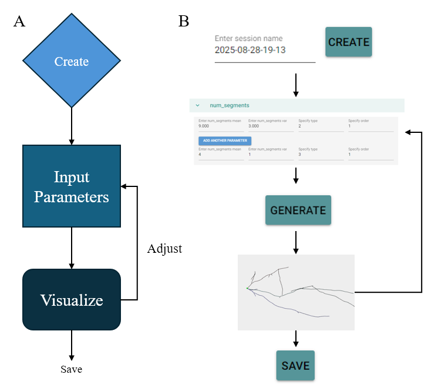

# Neuron Generator GUI User Guide
Welcome to the neuron morphology generator, a versatile and efficient simulation tool that generates morphology of neuron with distribution of parameters.

The generation is a GUI-based iterative process with visualization of generated neurons and adjustment of parameters, which is rendered in real time. The parameters are categorized into various biological scales. For details of the parameters, please refer to [GUI user guide](rsc/GUI_User_Guide.md). The parameters can be customized and expanded upon user's need. 

Right now only human pyramidal neuron is provided as template. More templates will be uploaded with the publication of manuscript.

Some additional visualization software such as [VAA3D](https://github.com/Vaa3D) and [neuTube](https://www.neutracing.com/) is also useful. 

### To run the GUI:
```
git clone https://github.com/kerenzhang/neuron-morph-gen.git
cd neuron-morph-gen
pip install -r requirements.txt
python gui.py
```

### Workflow (details in [GUI user guide](rsc/GUI_User_Guide.md))



