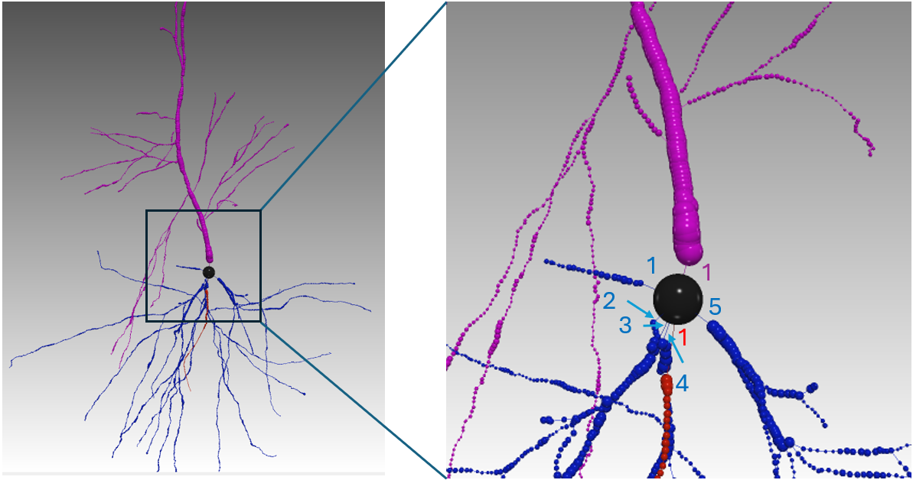
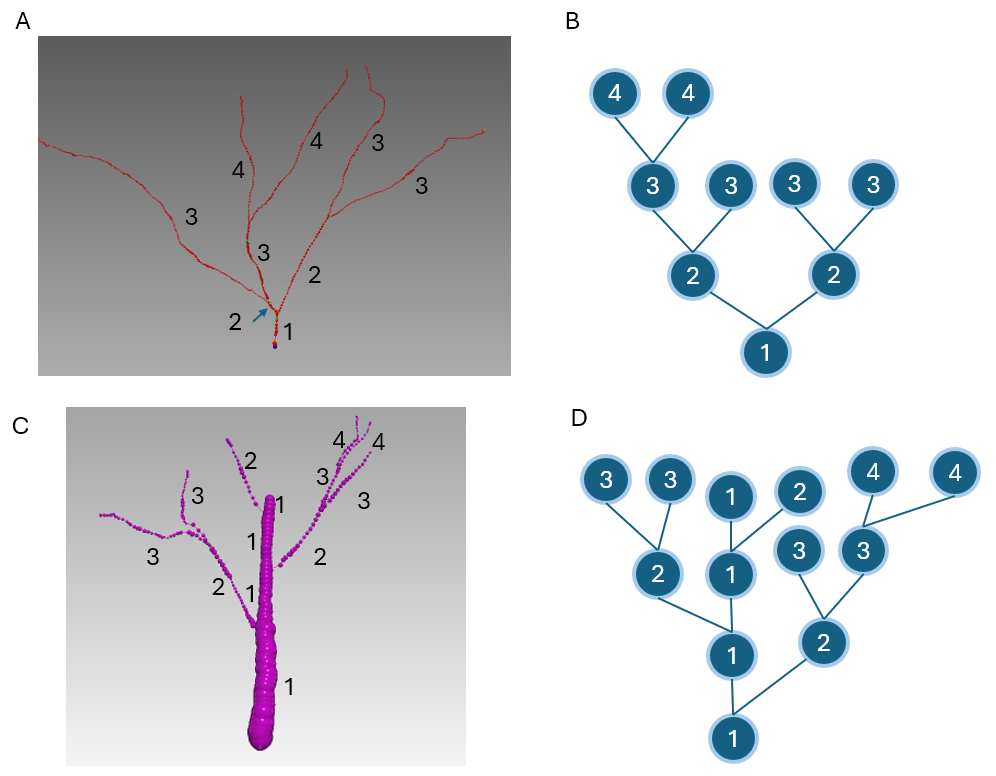
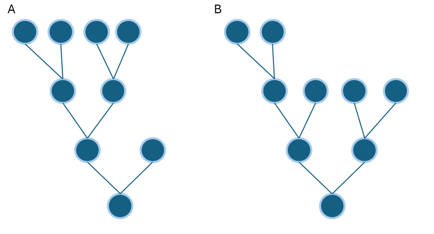
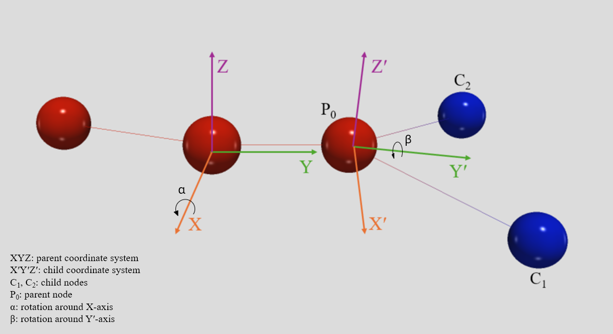
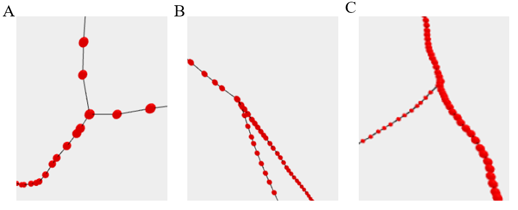
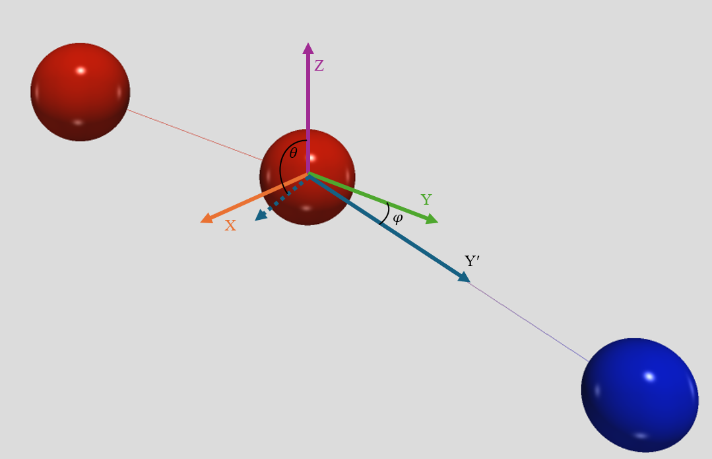
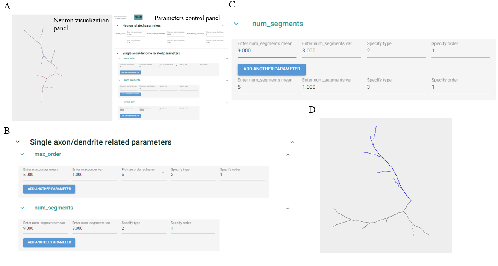

# Neuron Generator GUI User Guide

**Author:** Keren Zhang  
**Source manual date:** August 28, 2025

## 1. Overview

The Neuron Generator GUI is a browser-based interface that runs on `localhost`. It is designed to help users visualize how different morphology parameters affect generated neuron structures. The workflow is iterative: define parameters, generate a neuron, inspect the morphology visually, adjust parameters, and save the result when satisfied.

The GUI uses mean-variance-based parameters with several distribution types. Some parameters are literature-based, while others are manually defined to match extracted morphology histograms. The default reference morphology is a human pyramidal neuron. Parameters are organized by biological scale:

1. neuron-level parameters,
2. axon/dendrite tree-level parameters,
3. branch-level parameters,
4. bifurcation-level parameters,
5. node-level parameters.

---

## 2. Parameter Reference

### 2.1 Neuron-level parameters

Neuron-level parameters define how many independent axon or dendrite trees are connected to the soma.

| Parameter | Description | Range | Distribution |
|---|---|---:|---|
| `num_axons` | Number of axons. In standard SWC format, axons are type `2`. Usually there is one axon stemming from the soma. | `[0, inf)` | Normal |
| `num_basal_dendrite` | Number of basal dendrites. In standard SWC format, basal dendrites are type `3`. | `[0, inf)` | Normal |
| `num_apical_dendrite` | Number of apical dendrites. In standard SWC format, apical dendrites are type `4`. | `[0, inf)` | Normal |


* Figure 1. Number of axons, basal dendrites, and apical dendrites within a single neuron tree. Red is axon, blue is basal dendrite, and purple is apical dendrite. Arrow and number denote an individual axon/dendrite. This neuron has 1 axon, 1 apical dendrite and 5 basal dendrite.
---

### 2.2 Single axon/dendrite tree parameters

These parameters define the topology and overall geometry of each axon or dendrite tree.

#### `max_order`

`max_order` is the maximum order of all branches in a tree. Order is defined as the minimum path length from a given node to the root, which is the soma. Equivalently, it is the number of branch segments along the path, or the number of bifurcations encountered plus one.

Two order schemes are supported:

- `c`: centrifugal order scheme. This is the common graph-theoretic interpretation, where order increases as the path moves away from the root.
- `s`: shaft order scheme. This is useful when a neuron has one dominant shaft-like path. All branch segments on the major path are treated as order 1, and side branches are treated as smaller subtrees.

| Parameter | Description | Range | Distribution |
|---|---|---:|---|
| `max_order` | Maximum branch order in a tree. | `[1, inf)` | Normal |


* Figure 2. Tree structure and schematic diagram of two order schemes. A and B show the centrifugal scheme; C and D show a shaft-like scheme. The number indicates branch order.

#### `num_segments`

`num_segments` is the total number of branch segments in a tree. It controls the sparseness of the morphology. Fewer segments with a high `max_order` make the tree look sparse.

| Parameter | Description | Range | Distribution |
|---|---|---:|---|
| `num_segments` | Total number of branch segments in a tree. | `[2 * max_order - 1, 2^max_order - 1]` | Normal |

#### `symmetry`

`symmetry` describes how symmetric the tree is. A value close to 1 indicates a highly symmetric tree, while a value close to 0 indicates that more branches are positioned on one side.

| Parameter | Description | Range | Distribution |
|---|---|---:|---|
| `symmetry` | Degree of tree symmetry. | `[0, 1]` | Normal |

#### `d2h_ratio`

`d2h_ratio` is the ratio between tree diameter and tree height. Tree diameter is defined as the longest path between any two terminal nodes. A larger value makes the tree look flatter.

| Parameter | Description | Range | Distribution |
|---|---|---:|---|
| `d2h_ratio` | Tree diameter-to-height ratio. | `[1, 2]` | Normal |


* Figure 3. Two trees with the same max order and number of segments but different d2h ratio and symmetry. B is flatter and more symmetric than A.

#### `init_vec`

`init_vec` controls the initial direction of the axon or dendrite stem. It is sampled using a von Mises-Fisher distribution with an average direction in the absolute coordinate system and concentration parameter `kappa`.

| Parameter | Description | Range | Distribution |
|---|---|---:|---|
| `init_vec` | Initial direction of the axon/dendrite stem. | `[[0, inf), [0, inf), [0, inf)]` | von Mises-Fisher |

#### `init_r`

`init_r` is the initial radius of the axon or dendrite at the stemming point. This is often the thickest part of the tree and is reported in microns.

| Parameter | Description | Range | Distribution |
|---|---|---:|---|
| `init_r` | Initial stem radius. | `[0, inf)` | Normal |

---

### 2.3 Branch-level parameters

Branch-level parameters define the morphology of individual branch segments. Each branch is a linear subtree of the parent axon or dendrite tree.

#### `length`

`length` is the length of a branch in microns. Branch length often follows a log-normal-like distribution because of incremental growth. Because branches can be either long major branches or short connecting branches, the distribution is modeled as bi-log-normal.

| Parameter | Description | Range | Distribution |
|---|---|---:|---|
| `length` | Branch length in microns. | `[0, inf)` | Bi-log-normal |

#### `contra_factor`

`contra_factor` controls radius contraction along a branch. Linear radius decay is used.

```text
contra_factor = r_end / r_start
```

A value greater than 1 means expansion. A value less than 1 means contraction.

| Parameter | Description | Range | Distribution |
|---|---|---:|---|
| `contra_factor` | Radius contraction or expansion factor along the branch. | `[0, inf)` | Normal |

#### `hist_w`

`hist_w` is the weight of moving-average smoothing using previous vectors. The past three vectors are used. Larger values make the curve smoother, but may remove local directional variation.

```text
v' = v0 + hist_w * sum(v_i)
```

| Parameter | Description | Range | Distribution |
|---|---|---:|---|
| `hist_w` | Weight of history-based smoothing. | `[0, inf)` | Uniform |

#### `proj_w`

`proj_w` is the weight of guidance from the initial vector of a branch after bifurcation. It helps the branch deviate less from its initial direction.

```text
v' = v0 + hist_w * sum(v_i) + proj_w * v_init
```

| Parameter | Description | Range | Distribution |
|---|---|---:|---|
| `proj_w` | Weight of initial-vector projection guidance. | `[0, inf)` | Uniform |

---

### 2.4 Bifurcation-level parameters

Bifurcation-level parameters control how a parent branch splits into two child branches.

The parent plane is the `XY` plane used during parent branch growth, with the `Y` axis defined by the last parent segment. The child plane is spanned by the two child vectors. The child coordinate system is rotated from the parent coordinate system in intrinsic `X-Y-Z` order:

1. rotate around the `X` axis to create tilt,
2. rotate around the new `Y'` axis to create roll,
3. rotate around the new `Z'` axis to create bifurcation asymmetry.

After this coordinate-system rotation, the new `Y` axis is rotated counter-clockwise and clockwise to create the two child vectors.


* Figure 4. Bifurcation geometry with parent and child coordinate systems. The parent node is P0 and the child nodes are C1 and C2.

#### `ampl`

`ampl` is the amplitude of the split angle between two daughter branches.

| Parameter | Description | Range | Distribution |
|---|---|---:|---|
| `ampl` | Split angle amplitude between daughter branches. | `[0, 2pi]` | Log-normal |

#### `tilt`

`tilt` is the deviation of the child coordinate system from the parent plane with respect to the `X` axis. For example, `0.5pi` gives a vertical turn.

| Parameter | Description | Range | Distribution |
|---|---|---:|---|
| `tilt` | Tilt of the child coordinate system from the parent plane. | `[0, pi/2]` | Log-normal |

#### `roll`

`roll` is the rotation of the `X'Z'` plane around the `Y'` axis. Because of the mirror effect between `theta` and `theta + pi`, this parameter is modeled with a bimodal von Mises distribution.

| Parameter | Description | Range | Distribution |
|---|---|---:|---|
| `roll` | Rotation around the child `Y'` axis. | `[[0, 2pi], inf)` | Bimodal von Mises |

#### `ratio`

`ratio` is the ratio between the two angles formed by the two child vectors and the parent vector. For convenience, it is defined as the larger angle divided by the smaller angle.

A ratio close to 1 indicates an evenly split bifurcation. A very large ratio, such as greater than 10, indicates a dominant child branch that barely changes direction after bifurcation.

| Parameter | Description | Range | Distribution |
|---|---|---:|---|
| `ratio` | Angle ratio between the two child branches. | `[1, inf)` | Exponential-uniform |


* Figure 5. Examples of different bifurcation geometries. A: angle 1.2, tilt 0.2, roll 0.1, ratio 1. B: angle 0.8, tilt 0.8, roll 1.5, ratio 1. C: angle 0.8, tilt 0.1, roll 0.2, ratio 40.
---

### 2.5 Node-level parameters

Node-level parameters control individual nodes along each branch segment.

| Parameter | Description | Range | Distribution |
|---|---|---:|---|
| `step_size` | Distance between adjacent nodes. | `[0, inf)` | Normal |
| `phi` | Magnitude of angle change of the new growth vector. In spherical coordinates, `phi` is the angle between the new vector and the `Y` axis. | `[0, 2pi]` | Log-normal |
| `theta` | Rotation of the new vector around the old vector. | `[0, 2pi]` | Bimodal von Mises |


* Figure 6. Direction change during neurite growth. The new vector is described using spherical coordinates, where phi is the angle between the new vector and the Y axis, and theta is the angle between the projection onto the XZ plane and the Z axis.
---

## 3. Using the GUI

The GUI has two main panels:

- **Visualization panel:** displays the generated neuron morphology.
- **Parameter control panel:** lets the user edit morphology parameters.

Parameters are grouped by scale. Each group can be expanded or collapsed. For each parameter, the user can specify the mean and variance according to its distribution type.

For bimodal distributions, an additional `ratio` parameter controls the relative contribution of the two modes:

```text
P_bi = ratio * P0 + (1 - ratio) * P2
```

Here, `P_bi` is the bimodal probability density, and `P0` and `P2` are the two single-mode probability densities. A value of `0.5` gives equal likelihood to both modes, while a value of `1` removes the second distribution.


* Figure 7. GUI overview. A: layout with visualization panel and parameter control panel. B: parameter groups. C: adding parameters by type and order. D: generated morphology visualization.
### 3.1 Specify parameters by type and order

The GUI allows parameter values to be specified by neurite type and branch order. For example, `num_segments` can be defined differently for:

- axon, type `2`, order `1`,
- basal dendrite, type `3`, order `1`.

To add a type/order-specific setting, click **Add Another Parameter** for the relevant parameter group.

It is not necessary to specify every parameter for every type and order. If a value is missing, the GUI interpolates or copies the nearest specified value:

- If `length` is specified for type-2-order-1 and type-2-order-4, then type-2-order-2 uses the value from type-2-order-1.
- If a basal dendrite parameter is not specified, it is assumed to match the corresponding axon parameter. For example, type-3-order-1 uses type-2-order-1.

### 3.2 Generate, inspect, adjust, and save

The typical workflow is:

1. Click **Create** and enter a session name.
2. Input or adjust parameters.
3. Click **Generate** to visualize a neuron.
4. Inspect the morphology in the visualization panel.
5. Adjust parameters if needed.
6. Click **Save** when the generated morphology is satisfactory.


* Figure 8. GUI workflow. The GUI is used iteratively: create a session, input parameters, generate and visualize the neuron, adjust parameters, and save.
---

## 4. Quick Reference

### Neurite type labels

| Type ID | Meaning |
|---:|---|
| `2` | Axon |
| `3` | Basal dendrite |
| `4` | Apical dendrite |

### Main workflow

```text
Create session -> Input parameters -> Generate -> Visualize -> Adjust -> Save
```

### Recommended usage pattern

Start with default or literature-based parameters, generate a neuron, and then adjust parameters by scale:

1. set neuron-level counts,
2. tune tree-level topology and geometry,
3. tune branch shape,
4. tune bifurcation geometry,
5. tune node-level smoothness and directional variation.

This makes the parameter search easier because large-scale morphology is controlled before fine-scale geometry.
